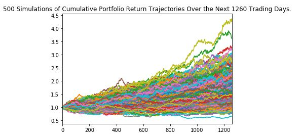
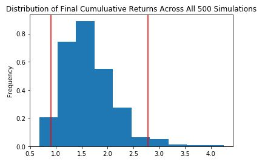

# Financial Planning

## Case 1 - Personal Finance Planner: 

* You decided to start a FinTech consultancy firm, and you want to make a difference by working on projects with high social impact in local communities. You just won your first contract to help one of the biggest credit unions in your area. They want to create a tool that helps their members enhance their financial health. 

* The Chief Technology Officer (CTO) of the credit union asked you to develop a prototype application to demo in the next credit union assembly.

* The credit union board wants to allow the union's members to assess their monthly personal finances, and also be able to forecast a reasonably good retirement plan based on cryptocurrencies, stocks, and bonds.

* The first will be a personal finance planner that will allow users to visualize their savings composed by investments in shares and cryptocurrencies to assess if they have enough money as an emergency fund.

* The second tool will be a retirement planning tool that will use the Alpaca API to fetch historical closing prices for a retirement portfolio composed of stocks and bonds, then run Monte Carlo simulations to project the portfolio performance at 30 years. You will then use the Monte Carlo data to calculate the expected portfolio returns given a specific initial investment amount.

## Case 2 - Retirement Planning
The CTO of the Credit Union was really impressed with your work on this planner, but commented that 30 years seems like such a long time to wait to retire! The CTO starts wondering if the retirement plan could be adjusted to account for an earlier than normal retirement.
Try adjusting the portfolio to either include more risk (a higher stock than bond ratio) or to have a larger initial investment and rerun the retirement analysis to see what it would take to retire in 5 or 10 years instead of 30!

## Examples of analysis:

